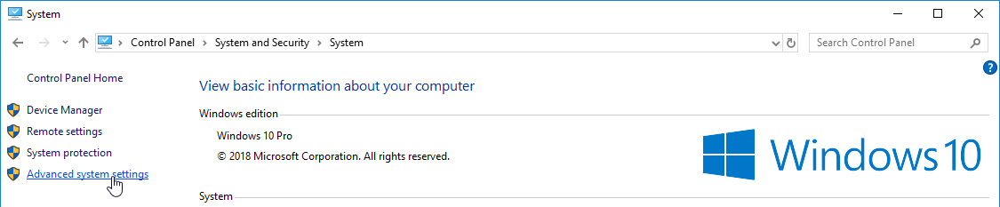
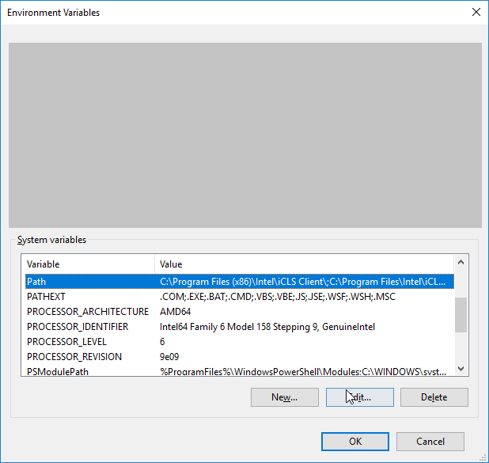

# Client-Server Chat Room using Java Server Socket

A chat room with one central server that allows you to connect multiple clients to the server to exchange messages. You can change usernames and exit room chat using interactive commands.

This is a Command Line Java program and runs in CLI (Command Line Interface) Applications such as: Command Prompt, Powershell, Terminal, Git Bash etc.

<p align="center">

</p>


## Table of Contents

- [Features](#features)
- [How to Run](#how-to-run)
- [Commands](#commands)
- [Setup for Developers](#setup-for-developers)
  - [Installing Java SE Development Kit (JDK)](#installing-java-se-development-kit-jdk)
  - [Integrated Developemt Environment (IDE)](#integrated-developemt-environment-ide)

## Features

1. Send and receive messages between multiple clients in real time.
2. Fast and Reliable.
3. Limitless Connections.
4. Interactive commands.

## How to Run

- Download and install [Java SE Development Kit (JDK)](https://www.oracle.com/eg/java/technologies/downloads/) for free from [Oracle](https://www.oracle.com) (recommended: JDK version 19)
- Download the source code from this repository in zip format.
- Extract the zip file using an Extractor (such as WinRAR, 7-Zip etc.)
- Alternatively, you can clone this repository and get the source code of this project if you have [Git](https://git-scm.com) installed on your PC. Type this command in your terminal and press ***Enter:***

```console
git clone https://github.com/Cyruskripsin/Client-Server-Chat-Room-using-Java-Server-Socket.git
```

- Open 3 different windows/sessions of the command Line Application of your choice on your PC.
- The first window will be used to startup the server and the other two windows will serve as the clients to connect to the server. **NB. You can connect more than two client to the server by opening additional terminal windows.**
- In all the 3 terminal windows, **move** to the directory where you extracted the source code or the working directory where you cloned this git repo using the `cd` command followed by the the folder path:

```console
cd /path/
```

- Move to the **src** directory in all 3 terminal windows by typing:

```console
cd src/
```

- Compile **Server.java** and **Client.java** in the first terminal window by typing:

```console
javac Client.java Server.java
```

- This will create `Client.class`, `Client$InputHandler.class`, `Server.class` and `Server$ConnectionHandler.class` files in the `src` folder when compilation is complete (This is to check for any errors in the program)

- Startup the server in the first terminal by typing:

```console
java Server.java
```

- You can now connect to the server with multiple clients!
- Type the command below and hit ***enter*** in the second terminal to connect to the server:

```console
java Client.java
```

- Connect with the third client by typing the command below and hit ***enter*** in the third terminal:

```console
java Client.java
```

- You'll recieve notification on the client side and server side that you connected to the server. Same will happen if you change username and disconnect from the server.
- You can change username and exit the chat using the commands below in the [Commands Section](#commands)

## Commands

How to change Username:

```console
/user.name Michael
```

>This will change the username to Michael

Exit or Leave Chat Room:

```console
/quit
```

## Setup for Developers

This is a step by step guide on how to setup your Java Environment.

### Installing Java SE Development Kit (JDK)

- Download and install [Java SE Development KIt (JDK)](https://www.oracle.com/eg/java/technologies/downloads/) for free from [Oracle](https://www.oracle.com)

## Setup for Windows

To Complete Java Installation on Windows:

- Go to "System Properties" (Can be found on Control Panel > System and Security > System > Advanced System Settings)

- Click on the "Environment variables" button under the "Advanced" tab

- Then, select the "Path" variable in System variables and click on the "Edit" button

- Click on the "New" button and add the path where Java is installed, followed by \bin. By default, Java is installed in C:\Program Files\Java\jdk-11.0.1 (If nothing else was specified when you installed it). In that case, You will have to add a new path with: C:\Program Files\Java\jdk-11.0.1\bin

- Then, click "OK", and save the settings

- At last, open Command Prompt (cmd.exe) and type java -version to see if Java is running on your machine.

### Step 1



### Step 2


### Step 3



### Step 4


### Step 5


### Integrated Developemt Environment (IDE)

IntelliJ IDEA, NetBeans and Eclipse are popular IDEs for building Java projects because of its widerange support for Java Porgramming and are particularly useful when managing larger collections of Java files. However I used Visual Studio Code (Microsoft) to write the source code of this project.

#### How to Setup Java Environment in Visual Studio Code (VS Code)

- Download and install [Visual Studio Code](https://code.visualstudio.com/download) for Windows, Mac or Linux using this download link: <https://code.visualstudio.com/download>
- Launch VS Code and go to marketplace. You can use `ctrl+shift+x` shortcut on Windows and Linux, `command+shift+x` on Mac
- Search and install: `Extension Pack for Java` in visual Studio Code Marketplace.
- The Java extension will install the extensions below automatically:
  - Project Manager for Java (Microsoft)
  - Test Runner for Java (Microsoft)
  - Maven for Java (Microsoft)
  - Language Support for Java(TM) by Red Hat (Java Linting, Intellisense, formatting, refactoring etc.)
  - IntelliCode (Microsoft)
  - Debugger for Java (Microsoft)

  If any of the above Java Extensions fail to install automatically, install them manually.
